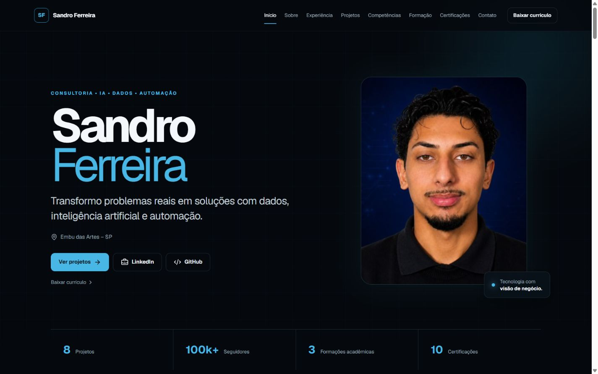

<p align="center">
  
</p>

# Portfólio Profissional — Sandro Ferreira

> Portfólio profissional criado para reunir minha trajetória, experiências, projetos e competências em consultoria, inteligência artificial, dados, automação e tecnologia.

**Site oficial:** [sandrozdb.com](https://sandrozdb.com)

## Sobre o projeto

Este portfólio foi desenvolvido como uma central da minha trajetória profissional e acadêmica, reunindo experiências, projetos, competências, formação e certificações em uma única experiência digital. Mais do que apresentar tecnologias, o objetivo é demonstrar como utilizo dados, inteligência artificial, automação e tecnologia para estruturar problemas e desenvolver soluções.

**Consultoria • Inteligência Artificial • Dados • Automação**

> Transformo problemas reais em soluções com dados, inteligência artificial e automação.

## O que você encontra no portfólio

- Sobre mim e posicionamento profissional
- Experiência profissional
- Metodologia de resolução de problemas
- Projetos em destaque e outros projetos
- Competências técnicas e de negócio
- Formação acadêmica
- Certificações e idiomas
- Contato e currículo profissional

## Projetos em destaque

### LifeBox — Transporte Inteligente de Órgãos

Projeto acadêmico que integra IoT, telemetria, otimização de rotas, alertas, dashboard e análise operacional.

### Automação de Triagem de Notas Fiscais

Workflow com n8n, OCR e Python voltado à automação de processos documentais.

### Vitrine de Carreira

Plataforma web voltada ao diagnóstico profissional, posicionamento e evolução de carreira.

### Sistema IoT de Monitoramento Ambiental

Sistema com ESP32, sensores, atuadores e visualização de dados no ThingSpeak.

## Como eu penso

O processo começa pela estruturação do problema e das evidências antes da escolha da tecnologia:

```text
Problema
   ↓
Causas
   ↓
Impactados
   ↓
Dados e Evidências
   ↓
Solução
   ↓
Implementação
   ↓
Indicadores
   ↓
Resultados
```

## Tecnologias

- Next.js com App Router
- TypeScript
- Tailwind CSS
- Framer Motion
- Lucide React
- Vercel Analytics
- Next/Image

## Estrutura

```text
src/
├── app/             # aplicação, estilos, SEO e metadados
├── components/      # componentes visuais e interativos
├── data/            # projetos, experiências, formação e competências
└── types/           # tipagens TypeScript

public/
├── profile/         # foto profissional
├── projects/        # capas oficiais dos projetos
└── curriculo-sandro-ferreira.pdf

assets/
└── capa-portfolio.png  # captura real da Hero usada neste README
```

## Executar localmente

```bash
git clone https://github.com/sandrozdb/portfolio-sandro-ferreira.git
cd portfolio-sandro-ferreira
npm install
npm run dev
```

A aplicação estará disponível em [http://localhost:3000](http://localhost:3000).

## Qualidade

O projeto é verificado com:

- TypeScript em modo estrito
- ESLint
- Build de produção do Next.js
- Revisão responsiva em desktop e mobile
- HTML semântico e acessibilidade básica

```bash
npm run lint
npm run typecheck
npm run build
```

## Deploy

O projeto foi preparado para deploy contínuo na Vercel a partir da branch `main`.

**Domínio oficial:** `sandrozdb.com`

## Status

**Versão 1.0 concluída — pronta para produção.**

## Autor

**Sandro Ferreira**

- Portfólio: [sandrozdb.com](https://sandrozdb.com)
- LinkedIn: [linkedin.com/in/sandrozdb](https://www.linkedin.com/in/sandrozdb/)
- GitHub: [github.com/sandrozdb](https://github.com/sandrozdb)
